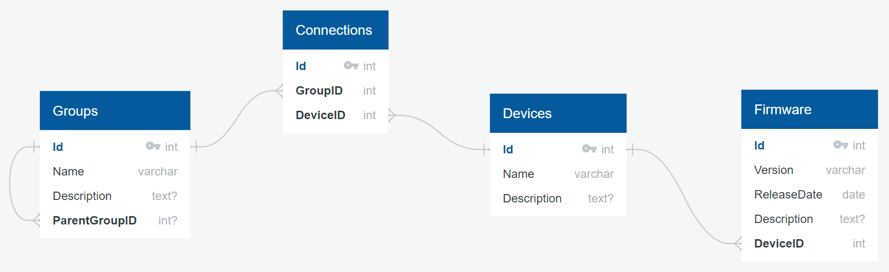

# Digital Matter Practical Exercise
This is the complete source code and results for the practical exercise from Digital Matter
* **Author:** Jacques Malan
* **Due date:** 9 May 2024

## Background:
You have been tasked to design a database for an IoT asset tracking and sensor monitoring hardware company. The company has multiple different device types on offer, each with varying capabilities.

## Task:
Design a database schema for a hierarchical grouping of IoT devices.
* Devices have Firmware.
* Firmware is versioned – and a Device has a certain version of Firmware.
* A Group can form part of another Group.
* A Device can be linked to a Group.

## Deliverables:
1. Create the scripts to create the database structure and populate it with a few records in each table.
2. Create a web application that can manage Groups and Firmware for devices.

## Tech Stack:
* We prefer `MSSQL` and `.NET` (`C#`, `HTML`, `JS`, `CSS`) however we will accept it in another stack provided the solution is well documented.

## Design:
The designed database schema is illustrated below:

The reasoning is as follows:
* Firmware is written for a specific device, leading to a many-to-one relationship between firmware and devices.
* As groups can be a part of another group, each group can (optionally) be linked to a parent group.
* Since multiple devices can be part of a single group, and multiple groups can contain the same device, the relationship between devices and groups are many-to-many. The solution is the Connections join table that directly links groups and devices via their respective IDs.

## Results:
The web-app requires that **Visual Studio 2022** be installed with the workload **ASP.NET and web development**. 
1. To generate the database with populated values, run the `generate_database.bat` script within the project folder.
2. To run the app, open the project in Visual Studio and click the green play button (or press F5).

## Comments:
The generated database is based on the devices and groups found on [www.digitalmatter.com/our-devices](https://www.digitalmatter.com/our-devices/). However, its generated firmware details are random and bare no relation to the actual devices.

The web-app was created using the ASP.NET Razor Pages. Data models for the database was created and scaffolding tools for the data models was used to produce Create, Read, Update, and Delete (CRUD) pages.

The CRUD operations worked with the originally generated pages, but both the Create and Edit pages failed to save to the database on the updated structure. Debugging (and a significantly better understanding of the framework) is required to fix the issue.
